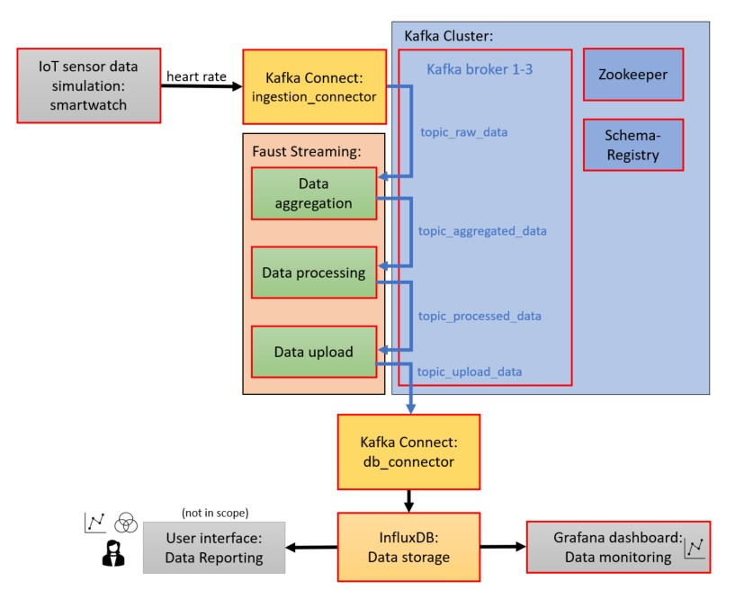
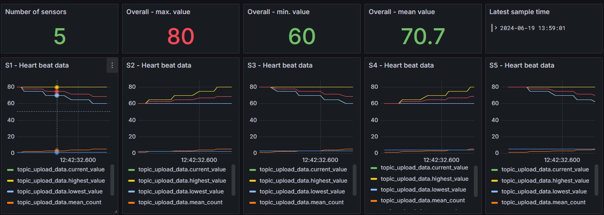

# iu_data_engineering

This repository represents an example infrastructure for a data intensive real time backend application based on Python and Infrastructure as Code (IaC).  
The infrastructure contains a Kafka cluster with several additions like Kafka connect clusters and Faust streaming.  
There is an example data source integrated which simulates continous value streams of an IoT smartwatch sensor.  
After some aggregation and processing activities the data will be uploaded to an InfluxDB database which can be monitored through a Grafana dashboard.  
All components are realized in Docker containers and orchestrated by Docker-Compose.  

# Table of Contents
- [Prerequisites](#prerequisites)
- [Launch](#launch)
- [Project Description](#project-description)
- [Project Structure](#project-structure)
- [External Interfaces](#external-interfaces)
- [Testing](#testing)
- [Limitations](#limitations)
- [Integrating Batch Pipeline](#integrating-batch-pipeline)
- [Sources/Bibliography](#bibiography)

# Prerequisites

- [Linux OS](https://help.ubuntu.com/) (recommended distribution: Ubuntu 22.04.3 LTS) must be installed (e.g. in WSL2 or Virtual Machine environment)  
- [Git](https://git-scm.com/doc) (recommended version: 2.34.1) must be installed in the Linux environment. Make sure to set git configuration core.filemode == true to keep executable right for shell scripts when cloning repository.  
- [Docker Desktop](https://docs.docker.com/desktop/) (recommended version: 4.31.1) must be installed  
- Recommended Docker settings (depending on host system availability): >= 12GB RAM usage, <=800% CPU usage (8 cores)
- Internet connection is required for downloading docker containers  


# Launch

To get the backend application running on a local machine, the following steps are required:
1. Clone the repository
    ```
    git clone https://github.com/ChriZa1410/data_eng_backend.git  
    ```
    
2. Launch the backend infrastructure by running the Docker-Compose file inside the repository in detached mode
   ```
   docker-compose up -d --build
   ```
    Note: After installing the packages it can take up to 150 seconds until cluster components are completely bootet and synchronised.  

3. Stop the backend infrastructure
   ```
   docker-compose down
   ```


# Project Description

- Goals:  
  This project realizes an example backend infrastructure for handling data intensive real time stream processing applications. It was developed considering the main aspects reliability, scalability and maintainability.  
  Reliability and scalability can be achieved through the implementation of replication via three individual Kafka brokers which can balance the load dynamically depending on the amount of processed data. The brokers can also substitute each other in case of failures. On top of that the topics are created with 3 partitions and a replication factor of 3 which also provides reliability, scalability and especially fault tolerance and data safety inside the kafka cluster.
  With the deployment of individual microservices which communicate via defined interfaces maintainability is easily possible. With this restarting single microservices is also possible in case of disturbances.  

  As the infrastructure consists of more components the microservices are implemented as Docker containers which are orchestrated by Docker-Compose centrally what enables the administrator to manage and maintain the system.  

- Summary:  

  The backend application receives heart rate values by several IoT smartwatch sensors (simulated input data provided by a *.csv file source). After aggregating the input data some processing calculations are done over all known sensor values. After that the sensor information is split by sensor ID and then uploaded to an InfluxDB database separately. Uploaded data streams can be monitored with a Grafana dashboard.  

- Microservices (Kafka cluster components excluded):  
  Main functionality:  
  - data_simulator: simulates IoT smartwatches by providing sensor values to *.csv file
  - data_aggregation: fetches raw sensor data and aggregates data to a proper format
  - data_processing: fetches aggregated sensor data and processes data with some calculations (e.g. max/min/mean values for each sensor)
  - data_upload: fetches processed data and uploads data to Influxdb data sink
  - grafana: monitoring processed IoT sensor data by the kafka cluster
  - influxdb: InfluxDB database to store productive data

  Kafka connect components:
  - ingestion_connector: Source Connect cluster (FileSource) to append external data source (csv file) to the kafka cluster
  - db_connector: Sink Connect cluster (InfluxDB Sink) to append external data sink (InfluxDB) to the kafka cluster for storing productive data of the cluster
  - kafkaconnect_influxdb_sink_productive: stores productive data after being processed in the kafka cluster (is a sink connector instance inside db_connector cluster)

  - IoT_sensor_data_simulation_smartwatch_PRODUCTIVE: simulates an IoT data source of type smartwatch (is a \*.csv file source connector instance inside ingestion_connector cluster). Attention: You can only run *_PRODUCTIVE* OR *_TESTING* source at one time!
  - IoT_sensor_data_simulation_smartwatch_TESTING: simulates an IoT data source of type smartwatch with a specific and stable test dataset (is a \*.csv file source connector instance inside ingestion_connector cluster). Attention: You can only run *_PRODUCTIVE* OR *_TESTING* source at one time! See [Testing](#testing) for testing the architecture. 

  Initialization and Kafka periphery:
  - init-kafka-topics: defines the topics in the kafka cluster 
  - init-schema-registry: initializes schemas of kafka topics
  - init-databases: initializes InfluxDB database
  - init-kafkaconnect_influxdb_sink_productive: initializes sink connector instance inside db_connector cluster for productive data
  - control-center: Frontend hub to manage and check health and functionality of the kafka cluster

  More details about the microservices' functionality can be found in comments inside the code files.  

  
Source: Own illustration.

# Project Structure

```
├── README.md
├── docker-compose.yml
├── data
│   └── influxdb
├── data_aggregation
│   ├── Dockerfile
│   ├── aggregation.py
│   └── requirements.txt
├── data_processing
│   ├── Dockerfile
│   ├── processing.py
│   └── requirements.txt
├── data_simulator
│   ├── Dockerfile
│   ├── data_simulator.py
│   └── smartwatch_heartrate_source_data.csv
├── data_upload
│   ├── Dockerfile
│   ├── requirements.txt
│   └── uploading.py
├── databases
│   ├── Dockerfile
│   └── create_databases.sh
├── documentation
│   └── concept.jpg
├── provisioning
│   ├── dashboards
│   │   ├── dashboard.json
│   │   └── dashboard.yml
│   └── datasources
│       └── datasources.yml
└── schema-registry
    ├── Dockerfile
    └── create_schema.sh
```

Tree view created with [tree library](https://linux.die.net/man/1/tree).

# External Interfaces

- Grafana: `localhost:3000`  
  Initial login: user = admin, password = admin (credentials are already preset and do not need to be changed)  
  
  Smartwatch Heartrate - Dashboard (choose Dashboard in the Dasboard Menu)
    - the number of smartwatch sensors monitored by the backend infrastructure
    - max. heart rate value over all sensors
    - min. heart rate value over all sensors
    - mean heart rate value over all sensors
    - timestamp of last recorded data sample
    - all recorded values and meta data of each monitored smartwatch sensor

- Control-Center: `localhost:9021`  

  Confluent Platform's control center provides the possibility to check information and data inside the Kafka cluster, e.g.:
    - health of the brokers
    - existing topics
    - monitoring the data sent via the topics as a consumer's point of view

# Testing

For testing the functionality of the architecture a stable test dataset can be used what leads to reproducable results (test file: *smartwatch_heartrate_source_data_test.csv*).  
To use the test dataset follow these steps:  
1. In docker-compose.yml: Add block comment to deactivate container *IoT_sensor_data_simulation_smartwatch_PRODUCTIVE*
2. In docker-compose.yml: Remove block comment to activate container *IoT_sensor_data_simulation_smartwatch_TESTING*
3. Make sure that InfluxDB table *topic_upload_data* in database *data_storage* does not contain content (e.g. by executing "drop series from topic_upload_data")
4. Run command ``` docker-compose up -d ```
5. Check data flows in Grafana dashboard. Results should like this:

  
Source: Screenshot from own Grafana dashboard.

# Limitations

- Backend infrastructure project can be deployed on a local machine. The integration to a cloud is currently not possible.

- Implementation of the infrastructure focuses on:
  - modular setup with separate microservices which communicate via defined interfaces
  - microservices running in Docker containers and orchestration with Docker-Compose (Infrastructure as Code (IaC))
  - usage of existing Docker images which are configured/modified to achieve specific needs
  - creating own Docker containers with specific logical content to reach backend functionality
  - providing the possibility to check results of data processing via a Grafana dashboard
  - implementation of replication via multiple Kafka brokers

- Implementation does not fulfill all possible requirements regarding:
  - error handling along all microservices
  - security configurations regarding the container communication
  - deep analysis possibility via metrics data

- Sensor simulation contains fix number of IoT sensors (10) and value ranges to test basic functionality. This does not represent a real smartwatch sensor range.
- Overall performance of the infrastructure can still be improved, e.g. duration of startup
- Errors may occure during container startup and synchronisation process if the startup of containers last too long. In this case some of the containers need to be restarted.

- Licences: 
  - Control Center: Confluent Enterprise License
  - Kafka Connect, Schema registry: Confluent Community License
  - Others: Apache 2.0 License  
  for details, see https://docs.confluent.io/platform/current/installation/license.h

- Copyright by respective image providers.  


# Integrating Batch Pipeline

Modern big data architectures and applications often face the need of combining streaming and batch processing of data. Because of this a possible way of integrating a batch processing pipeline into the existing infrastructure will be discussed in this section.  

There are many possibilities of realising a parallel architecture for data streaming and batch processing. One way is to implement a Lambda architecture. In addition to the existing processing thread which will be called "Streaming/Speed layer" a second processing branch called "Batch layer" will be integrated in parallel. Both layers receive the input data from the data_ingestion microservice and can be implemented using Kafka in combination with Faust Streaming.  

In the Batch layer the raw input data will at first be stored in a database to collect several values for processing. After that the data will be cyclic aggregated as a batch what means a defined set of data values (e.g. all values of the past minute/hour or last 100 values, etc.). This aggregated information summarizes a lot of historical data and can be analysed in an overarching way. Inside the Batch layer data can be sent via separate Kafka topics and at least one additional database for storing batch data is required.

In the data pipeline a third layer called "Serving layer" can be implemented which combines the information of both the Streaming and the Batch layer. In this step the very actual information of the Straming layer and the overall historical information out of the Batch layer converge and are merged to a holistic knowledge about the application and can be presented to an appropriate audience.  

Each layer has its own advantages and disadvantages. The Streaming layer for example provides high timeliness of data but therefore requires a high performance and low latencies inside the processing cluster which means high costs in equipment and development. The Batch layer does not need that high processing performance because of its cyclic calculations and so can save effort. On top of that the quality and amount of data anlysis can be higher. The downside in this case is the delay between data generation and analysis.  

[Otun,2019]

# Bibliography

- Learned the basic handling of Docker containers with the demos of Github repository [docker/getting-started](https://github.com/docker/getting-started) 
- Made the first steps in the handling of Kafka components and Docker containers with [Steps to setup Kafka cluster on Local And Docker](https://medium.com/nerd-for-tech/steps-to-setup-kafka-cluster-on-local-and-docker-ae84324cde86) 
- Learned about Python based streaming library Faust which is based upon the ideas of Kafka Streaming with [Faust - Python Stream Processing](https://faust-streaming.github.io/faust/index.html) 
- Learned about Kafka Connect and InfluxDB sinks with [Using kafkaconnect](https://kafka-connect-manager.lsst.io/userguide.html) and [InfluxDB Sink Connector for Confluent](https://docs.confluent.io/kafka-connectors/influxdb/current/influx-db-sink-connector/overview.html)
- Project is inspired by conceptual ideas of [backend-infrastructure-demo](https://github.com/finkbefl/backend-infrastructure-demo) GitHub repository by [Florian Finkbeiner](https://github.com/finkbefl)
- Time series data simulation and storing in InfluxDB is inspired by [Time-Series with Kafka, Kafka Connect & InfluxDB](https://lenses.io/blog/2016/12/kafka-influxdb/) by [Christina Daskalaki](https://lenses.io/author/christina-daskalaki/)
- Otun, Oluwaseyi (2019): Lambda Architecture with Kafka, Spark Streaming, Flume, Hadoop HDFS and Cassandra NoSQL Database in BigData Ecosystem. LinkedIn.com [https://www.linkedin.com/pulse/lambda-architecture-kafka-spark-streaming-flume-hadoop-otun](https://www.linkedin.com/pulse/lambda-architecture-kafka-spark-streaming-flume-hadoop-otun)